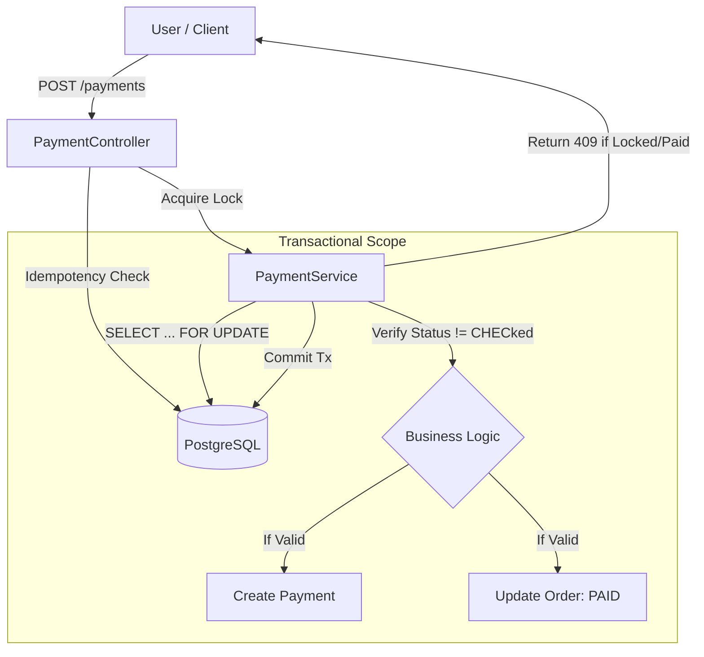

# Transactional Order & Payment System

A high-performance, strictly consistent backend service designed to handle financial transactions. Features **Pessimistic Locking**, **Idempotency**, and **ACID guarantees**.


## 🚀 Features

- **🛡️ Pessimistic Locking** - `SELECT ... FOR UPDATE` prevents Double Spending.
- **🔄 Idempotency** - Unique `Idempotency-Key` header ensures safe retries.
- **⚡ Optimistic Locking** - `@Version` tracking prevents "Lost Updates" on order state.
- **🧪 Resilience** - 100% concurrency safety (verified with stress tests).
- **📝 Global Error Handling** - Clean `409 Conflict` and `400 Bad Request` responses.

## 🛠️ Quick Start

### 1. Start Infrastructure
Starts PostgreSQL in a Docker container.
```bash
docker-compose up -d
```

### 2. Run Application
Starts the Spring Boot Service on port 8080.
```bash
mvn spring-boot:run
```

### 3. Verify Concurrency (The "Silver Bullet" Test)
Runs a script that fires **10 concurrent payment requests** for the same order.
```bash
./test-concurrency.sh
```
**Expected Output:**
- 1 Request: `200 OK` (Status: SUCCESS)
- 9 Requests: `409 Conflict` (Blocked by Lock)

## 🏗️ Architecture



## 📝 API Endpoints

| Method | Endpoint | Description | Headers |
|--------|----------|-------------|---------|
| `POST` | `/orders` | Create a new order | `userId`, `amount` |
| `GET` | `/orders/{id}` | Get order status | - |
| `POST` | `/payments` | Process Payment (Thread-Safe) | `Idempotency-Key` (UUID) |

## ⚡ Performance & Safety

Tested on local development environment.

| Scenario | Result | Mechanism |
|--------|------------|---------------|
| **Duplicate Key** | **409 Conflict** | `PaymentRepository.findByIdempotencyKey` |
| **Concurrent Pay** | **Blocked** | `LockModeType.PESSIMISTIC_WRITE` |
| **Stale Update** | **Exception** | `@Version` Optimistic Lock |

## 🔍 Debugging

**Database Access**
Connect to the running Postgres container:
```bash
docker exec -it transactional-db psql -U user -d transactional_db
```
