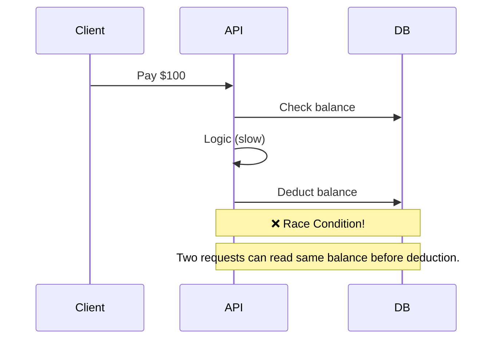
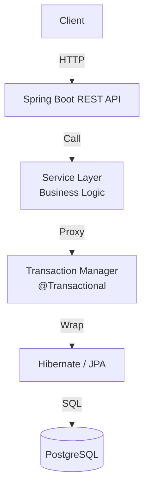
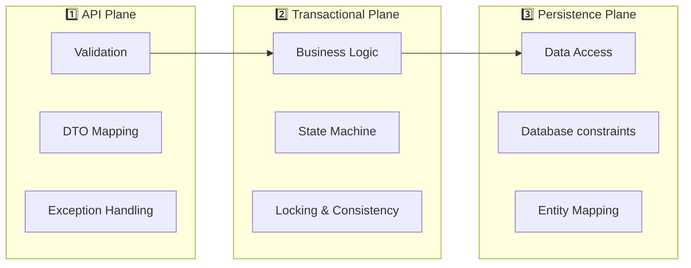
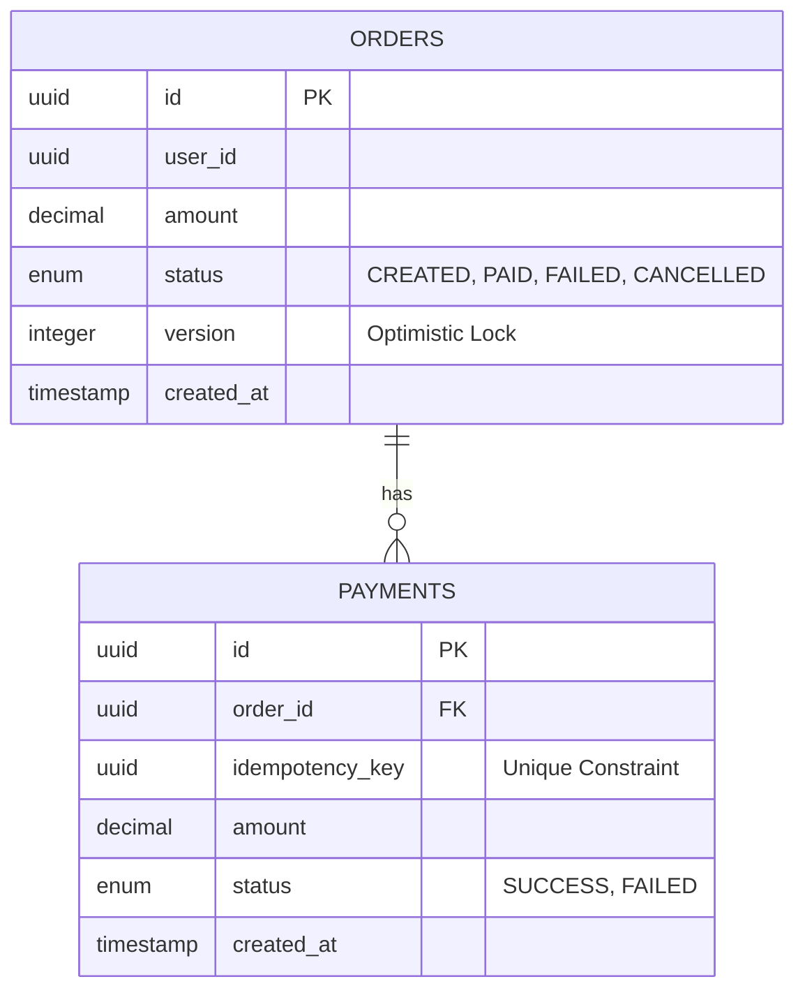
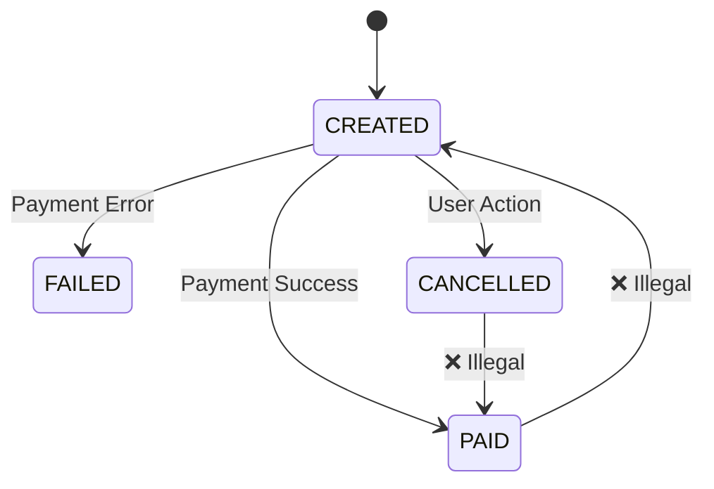
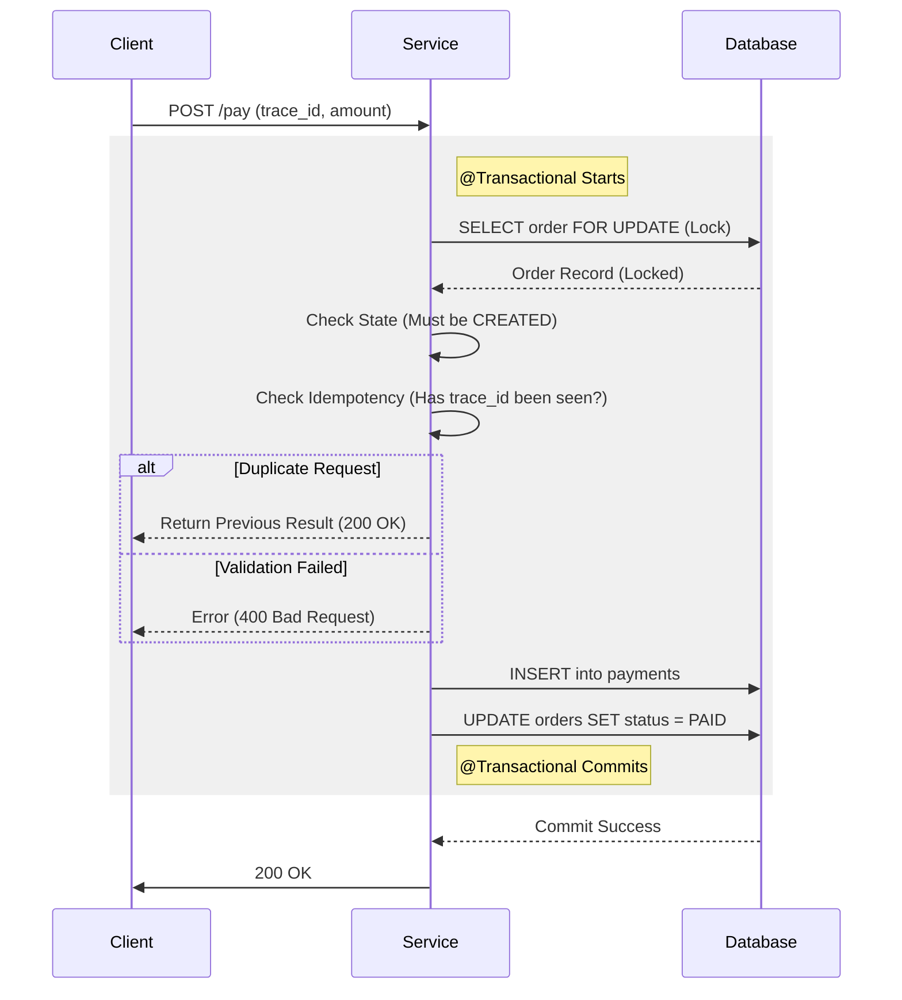
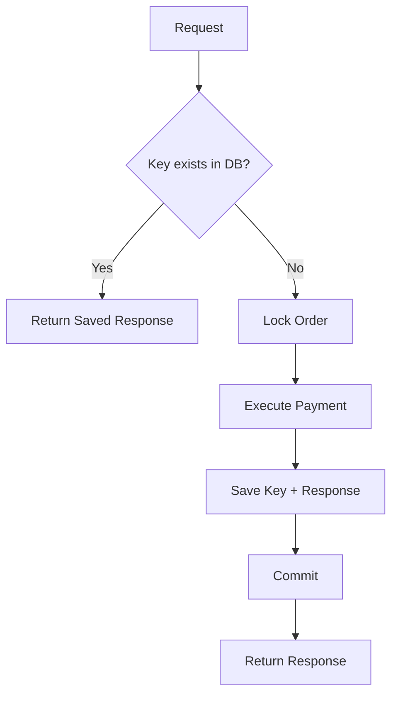

# Transactional Order & Payment Processing System - Architecture

A robust backend system that processes orders and payments using Spring Boot and Hibernate, guaranteeing data consistency, idempotency, and correct state transitions under retries and concurrent requests.

---

## Table of Contents

1. [One-Line Definition](#one-line-definition)
2. [Why This System Exists](#why-this-system-exists)
3. [High-Level Architecture](#high-level-architecture)
4. [The Three Planes](#the-three-planes)
5. [Core Components](#core-components)
6. [Data Model](#data-model)
7. [Transaction Design](#transaction-design)
8. [Locking Strategy](#locking-strategy)
9. [Payment Flow (Write Path)](#payment-flow-write-path)
10. [Idempotency](#idempotency)
11. [Failure Scenarios](#failure-scenarios)
12. [Project Structure](#project-structure)
13. [Tech Stack](#tech-stack)
14. [What This Project Proves](#what-this-project-proves)

---

## One-Line Definition

> A transactional backend system that processes orders and payments using Spring Boot and Hibernate, guaranteeing data consistency, idempotency, and correct state transitions under retries and concurrent requests.

**If you can't explain this in one line, you don't understand transactions.**

---

## Why This System Exists

### The Naïve Approach (WRONG)



**Problems with the naïve approach:**
- **Race Conditions:** Two concurrent requests behave incorrectly.
- **Double Payments:** Network retries cause multiple charges.
- **Inconsistent State:** Order marked PAID but Payment record missing (or vice versa).
- **Lost Updates:** Overwriting data without version checks.

### The Real Problem

| Requirement | Why It Matters |
|-------------|----------------|
| **Atomicity** | All or nothing. No partial updates. |
| **Isolation** | Concurrent requests must not interfere. |
| **Idempotency** | Retrying a request must not duplicate side effects. |
| **Consistency** | State must be valid at all times (e.g. Total Paid <= Order Amount). |

**This is why we use ACID transactions and Pessimistic Locking.**

---

## High-Level Architecture



---

## The Three Planes

We separate concerns to ensure clean code and testability.



### Responsibility Breakdown

| Plane | Responsibility | What It NEVER Does |
|-------|---------------|-------------------|
| **API** | Parse JSON, Validate Input, Return HTTP Codes | Business Rules, DB Transactions |
| **Transactional** | ACID execution, Locking, Idempotency Check | HTTP logic, Raw SQL |
| **Persistence** | CRUD operations, Query definitions | Complex Logic, External API calls |

---

## Core Components

### 5.1 Order Service

**Responsibilities:**
- Manage Order lifecycle (`CREATED` -> `PAID`).
- Ensure valid state transitions.
- Handle optimistic locking collisions.

### 5.2 Payment Service

**Responsibilities:**
- Process payments transactionally.
- Acquire **Pessimistic Locks** on Orders.
- Enforce Idempotency.
- Atomic updates (Create Payment + Update Order).

### 5.3 PostgreSQL Database

**Responsibilities:**
- Source of truth.
- Enforce constraints (Foreign Keys, Unique Constraints).
- handle row-level locking (`SELECT ... FOR UPDATE`).

---

## Data Model

### Entity-Relationship Diagram



### SQL Schema

```sql
CREATE TABLE orders (
    id UUID PRIMARY KEY,
    user_id UUID NOT NULL,
    amount DECIMAL(19, 2) NOT NULL,
    status VARCHAR(20) NOT NULL,
    version INTEGER NOT NULL DEFAULT 0, -- Optimistic Locking
    created_at TIMESTAMP DEFAULT NOW()
);

CREATE TABLE payments (
    id UUID PRIMARY KEY,
    order_id UUID NOT NULL REFERENCES orders(id),
    idempotency_key UUID NOT NULL UNIQUE, -- Crucial for Idempotency
    amount DECIMAL(19, 2) NOT NULL,
    status VARCHAR(20) NOT NULL,
    created_at TIMESTAMP DEFAULT NOW()
);

CREATE INDEX idx_orders_user ON orders(user_id);
```

---

## Transaction Design

### Boundaries

The transaction boundary is at the **Service Layer Method**.

```java
@Transactional(isolation = Isolation.READ_COMMITTED)
public PaymentResponse processPayment(...) {
    // Everything here is atomic
}
```

### Order State Machine



You **must** enforce these transitions in code.

---

## Locking Strategy

### Pessimistic Locking (The "Mutex")

Used for **Payment Processing**.

**Why?** we need to prevent two concurrent payments for the same order.

```java
// "SELECT * FROM orders WHERE id = ? FOR UPDATE"
@Lock(LockModeType.PESSIMISTIC_WRITE)
Optional<Order> findByIdWithLock(UUID id);
```

### Optimistic Locking (The "Version Check")

Used for **General Order Updates**.

**Why?** Prevents "Lost Updates" without blocking the database.

```java
@Version
private Integer version;
```

---

## Payment Flow (Write Path)

This is the most critical flow in the system.



---

## Idempotency

### The Problem
Client clicks "Pay" twice, or network times out after server processes request. 
**Result without idempotency:** User charged twice.

### The Solution
Accept a unique `Idempotency-Key` header from the client.



**Key Constraint:** `idempotency_key` column in `payments` table (or separate table) must have a `UNIQUE` constraint.

---

## Failure Scenarios

### Scenario 1: Double Click (Concurrent)
- **Request A** acquires Lock.
- **Request B** waits for Lock.
- **Request A** finishes, updates state to PAID, commits.
- **Request B** acquires Lock, reads state as PAID.
- **Request B** sees invalid state for payment -> Fails gracefully.

### Scenario 2: Network Timeout after Commit
- Server commits transaction.
- Response lost on network.
- Client retries with **Same Idempotency Key**.
- Server sees existing key.
- Server returns cached success response.
- **Result:** Correct.

### Scenario 3: Database Failure Mid-Transaction
- DB connection drops.
- Transaction manager performs `ROLLBACK`.
- No Payment record created. Order remains `CREATED`.
- **Result:** Safe to retry.

---

## Project Structure

```
src/main/java/com/example/transactional/
├── TransactionalApp.java
├── config/
├── controller/
│   ├── OrderController.java         # REST Endpoints
│   └── PaymentController.java       # Idempotency handling
├── dto/
│   ├── CreateOrderRequest.java
│   └── InitiatePaymentRequest.java
├── model/
│   ├── Order.java                   # @Entity, @Version
│   └── Payment.java                 # @Entity
├── repository/
│   ├── OrderRepository.java         # PESSIMISTIC_LOCK query
│   └── PaymentRepository.java
└── service/
    ├── OrderService.java
    └── PaymentService.java          # @Transactional magic
```

---

## Tech Stack

| Component | Technology | Purpose |
|-----------|------------|---------|
| Language | **Java 17+** | Enterprise standard |
| Framework | **Spring Boot 3** | DI, Web, Data |
| ORM | **Hibernate / JPA** | Object-Relational Mapping |
| Database | **PostgreSQL** | ACID-compliant storage |
| Testing | **JUnit 5, Mockito** | Unit & Integration tests |

---

## What This Project Proves

After Project 3, interviewers infer:

| Skill | Evidence |
|-------|----------|
| ✅ **ACID** | Understanding transaction boundaries and isolation. |
| ✅ **Concurrency** | Using Locks (Pessimistic/Optimistic) to prevent races. |
| ✅ **Correctness** | Idempotency implementation for distributed safety. |
| ✅ **ORM Mastery** | Handling Lazy loading, N+1, and Locking via JPA. |

This fills the **"Safe with Money"** gap in your profile.
